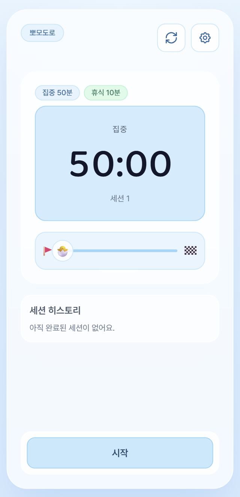
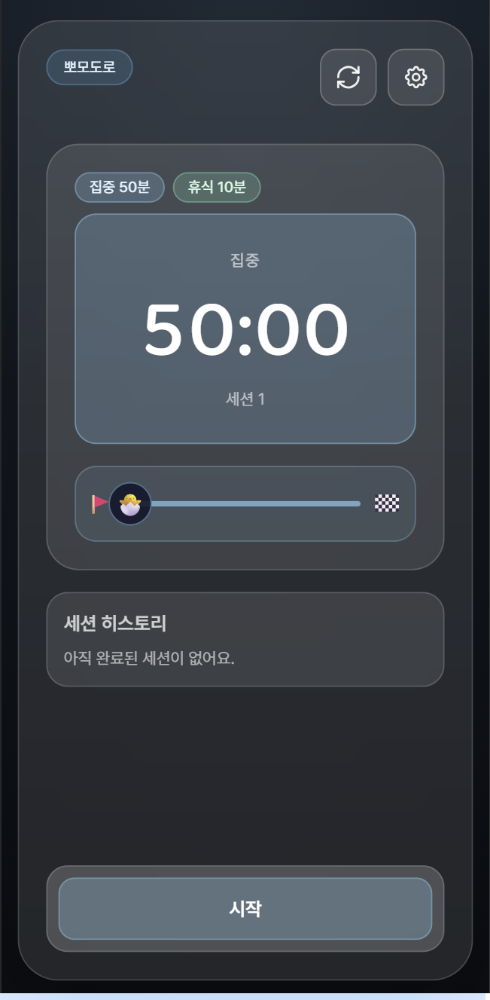

# 뽀모도로 (Pomodoro PWA)

집중할 땐 확실히 집중하고, 쉴 땐 제대로 쉬기 위한 뽀모도로 타이머 앱이에요.  
Next.js + Tailwind CSS로 만들었고, PWA 설정까지 되어 있어서 홈 화면 앱처럼 쓸 수 있어요.

## 뭐가 되나요?

- 기본 사이클: 집중 50분 / 휴식 10분
- 세션 목표 문구 입력/수정
- 세션 히스토리 기록
- 리셋/스킵 확인 모달
- 한국어/영어 전환
- 라이트/다크 테마
- 모바일 반응형 UI
- PWA 설치 지원

## 스크린샷

아래 경로에 이미지를 넣으면 README에서 바로 보여요.

```text
docs/screenshot-main.png
docs/screenshot-settings.png
docs/screenshot-dark.png
```

예시:





## 기술 스택

- Next.js 14 (App Router)
- React 18
- Tailwind CSS

## 로컬에서 실행하기

```bash
npm install
npm run dev
```

브라우저에서 `http://localhost:3000` 열면 됩니다.

## 프로덕션 빌드

```bash
npm run build
npm run start
```

## Vercel 배포

1. 이 저장소를 GitHub에 푸시
2. Vercel에서 `New Project` 클릭
3. 이 저장소를 Import
4. Framework Preset은 `Next.js` 그대로 사용
5. Deploy

현재는 별도 환경변수 없이 동작해요.

## PWA 설치 방법

### iPhone (Safari)

1. 배포 URL 접속
2. 공유 버튼 탭
3. `홈 화면에 추가`

### Android (Chrome)

1. 배포 URL 접속
2. `앱 설치` 또는 `홈 화면에 추가`

## 앱 아이콘 파일

- `public/icons/icon-192.png`
- `public/icons/icon-512.png`
- `public/icons/apple-touch-icon.png`

Manifest 파일:

- `public/manifest.webmanifest`

## 프로젝트 구조

```text
src/app/page.js            # 타이머 UI/기능 로직
src/app/layout.js          # 메타데이터, 폰트, SW 등록 컴포넌트 연결
src/app/globals.css        # 전역 스타일
src/app/sw-register.js     # 서비스워커 등록
public/manifest.webmanifest
public/sw.js
public/icons/*
```

## 스크립트

- `npm run dev` - 개발 서버 실행
- `npm run build` - 프로덕션 빌드
- `npm run start` - 빌드 결과 실행
- `npm run lint` - 린트 실행
